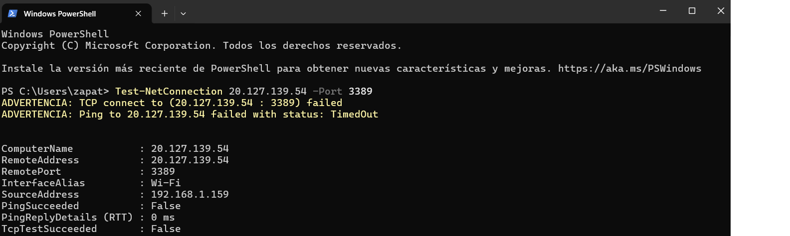
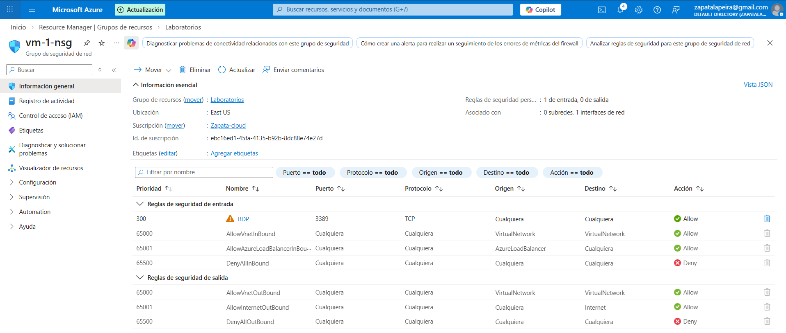
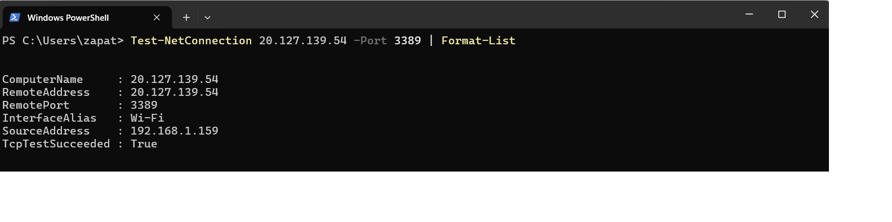

# Lab 31 – Incidencia: Conexión bloqueada por NSG (puerto cerrado)

## Objetivo
Reproducir un fallo de conectividad por NSG y resolverlo creando la regla correcta.

## Qué ha pasado (incidencia)
La VM está encendida y con IP/route bien, pero el puerto está bloqueado por una regla de NSG. El test de conectividad falla.

## Resolución
He identificado el NSG asociado, he creado una regla de entrada permitiendo el puerto y he validado con Test-NetConnection.

## Evidencias

### 01 – Test-NetConnection FAIL

### 02 – Regla NSG creada/modificada

### 03 – Test-NetConnection OK

## Qué diría en entrevista
“Cuando un puerto falla, reviso NSG efectivo, UDR y firewall del SO. Empiezo por el control más común: NSG en NIC/subnet.”
